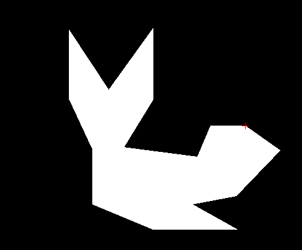

`Antoine DUMOULIN`

# Example

## Usage

'./plot 600 600'
left mouse click to add / select vertex
right mouse click for edge split in edge mode
`c` close polygon
`f` fill polygon
`i` insert mode
'v' vertex mode
'e' edge mode
'suppr' delete selected
'next page' / 'next page' to select next / last vertex
