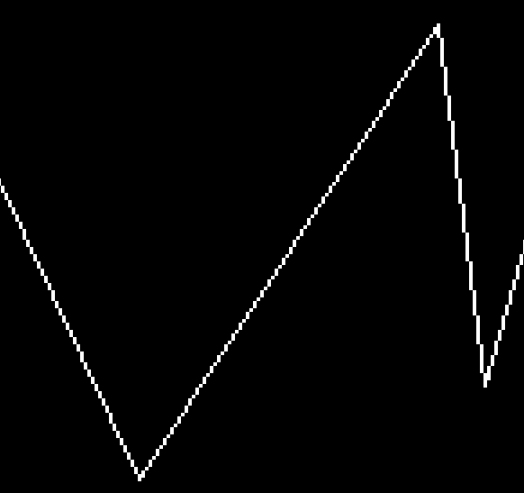
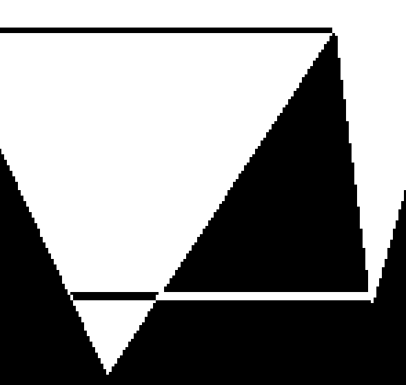

`Antoine DUMOULIN`

# Usage du programme

## Test de remplissage

1. ./plot 600 600
2. plusieurs cliques gauches pour ajouter des sommets
3. touche `c` pour fermer le polygone
4. touche `f` pour remplir le polygone

## Test mode vertex

1. ./plot 600 600
2. plusieurs cliques gauches pour ajouter des sommets
3. touche `v` pour passer en mode vertex
4. clique gauche pour selectionner un sommet
   ou clavier avec page suivante/précedante
5. fleches directionnelles pour déplacer les points
6. `suppr` pour supprimer le point sélectionné
7. touche `i` pour revenir au mode insert

## Test mode edge

1. ./plot 600 600
2. plusieurs cliques gauches pour ajouter des sommets
3. touche `e` pour passer en mode edge
4. clique gauche pour selectionner une arrête
   ou clavier avec page suivante/précedante
5. clique droite pour diviser l'arrête en deux
6. touche `i` pour revenir au mode insert

# Cas particuliers pour le remplissage

Les polygones non simples sont susceptibles de présenter des artefacts.

Je n'ai pas réussi à gerer correctement les cas où plusieurs lignes du polygones forment des composantes 4-connexes entre elles :

 | 
